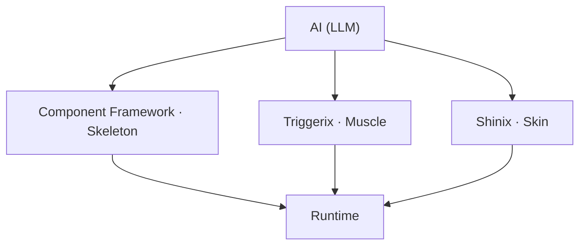
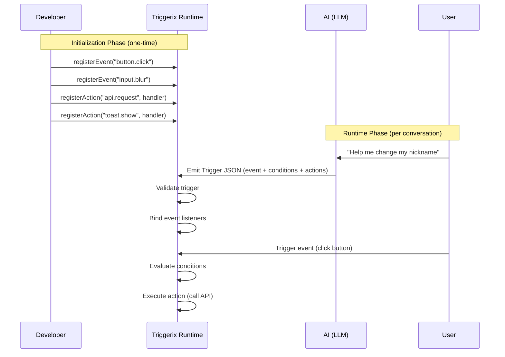

# Triggerix — The AI-Driven Interaction Protocol Layer

## Vision

Within an AI conversational flow, let the AI automatically generate fully runnable UI — not just static text or code snippets, but live component instances complete with interaction logic, styling, and real functionality.

Triggerix is the **interaction protocol layer** of this system, responsible for declaratively describing "what the user did → what conditions are met → what action to execute".

---

## Ecosystem Positioning

The full system is composed of three collaborating layers:



| Layer | Responsibility | Protocol Format |
|---|---|---|
| Component Framework | Defines the UI skeleton: which components exist, how they compose, where data comes from | JSON Schema |
| **Triggerix** | Defines interaction behavior: which events fire, which conditions are met, which actions run | Trigger Schema (ECA) |
| Shinix | Defines visual presentation: colors, spacing, animations, responsive layout | Style Schema |

The three are completely independent, each adopting JSON Schema as its protocol format, and are uniformly parsed and executed through the Runtime.

---

## Workflow

Triggerix itself is **business-agnostic**. It only provides the definition, validation, and execution engine for the ECA protocol. Concrete event types, condition logic, and action handlers are all injected by developers (or AI) through the registration mechanism.



**Key point**: Triggerix has no built-in business semantics. `button.click` and `api.request` are not preset by the framework — they are registered by developers based on their own business scenarios. Triggerix only orchestrates the flow of "when X happens → check Y → execute Z".

---

## Common Registration Examples

Below are events and actions developers typically register. These are merely examples — actual registrations are entirely up to the business.

<details>
<summary><strong>Event Registration</strong></summary>

```typescript
const runtime = createRuntime()

// UI interaction events
runtime.registerEvent('button.click')
runtime.registerEvent('input.blur')
runtime.registerEvent('input.change')
runtime.registerEvent('form.submit')
runtime.registerEvent('list.itemClick')

// Lifecycle events
runtime.registerEvent('page.load')
runtime.registerEvent('page.unload')

// Others
runtime.registerEvent('timer.tick')
runtime.registerEvent('file.selected')
```

</details>

<details>
<summary><strong>Action Registration</strong></summary>

```typescript
// API request
runtime.registerAction('api.request', async (params) => {
  const res = await fetch(params.url, {
    method: params.method,
    body: JSON.stringify(params.body)
  })
  return res.json()
})

// Toast message
runtime.registerAction('toast.show', (params) => {
  showToast(params.message, params.type)
})

// Page navigation
runtime.registerAction('navigate.to', (params) => {
  router.push(params.path)
})

// State update
runtime.registerAction('state.set', (params) => {
  store.set(params.key, params.value)
})

// Dialog
runtime.registerAction('dialog.open', (params) => {
  openDialog({ title: params.title, content: params.content })
})

// File picker
runtime.registerAction('file.pick', (params) => {
  openFilePicker({ accept: params.accept, multiple: params.multiple })
})
```

</details>

<details>
<summary><strong>Condition Operators (built-in, no registration needed)</strong></summary>

Conditions are a built-in capability of the protocol layer. Developers don't need to register them and can use them directly within triggers:

```typescript
import { defineCondition, defineConditionGroup } from '@triggerix/schema'

// Single condition
const isEmpty = defineCondition({
  left: { $ref: 'input.value' },
  operator: 'eq',
  right: ''
})

// Combined conditions
const canSubmit = defineConditionGroup({
  type: 'and',
  conditions: [
    { left: { $ref: 'input.value' }, operator: 'neq', right: '' },
    { left: { $ref: 'user.age' }, operator: 'gte', right: 18 }
  ]
})
```

Supported operators: `eq` · `neq` · `gt` · `gte` · `lt` · `lte` · `exists`

Supported logical combinators: `and` · `or` · `not`

</details>

<details>
<summary><strong>Flow Control (built-in, no registration needed)</strong></summary>

Flow control is also a built-in capability of the protocol layer, used to orchestrate complex action sequences:

```typescript
// Actions inside a trigger can use flow nodes
const trigger = defineTrigger({
  id: 'submit-profile',
  event: { type: 'button.click', source: 'save-btn' },
  actions: [
    sequence(
      { type: 'form.validate', params: { formId: 'profile' } },
      tryCatch({
        try: [
          { type: 'api.request', params: { method: 'POST', url: '/api/profile' } },
          { type: 'toast.show', params: { message: '保存成功' } }
        ],
        catch: [
          { type: 'toast.show', params: { message: '保存失败' } }
        ]
      })
    )
  ]
})
```

Supported nodes: `sequence` · `parallel` · `if` · `tryCatch`

</details>

---

## Triggerix's Core Role

### What it does

Triggerix is the behavioral protocol of **Event → Condition → Action**:

- **Event**: Describes when to trigger (click, input, focus, scroll, timer...)
- **Condition**: Describes prerequisites (whether a value is empty, whether a threshold is met...)
- **Action**: Describes the operation to perform (call an API, update state, navigate, show a toast...)

### What it doesn't do

- Doesn't handle UI structure (that's the component framework's job)
- Doesn't handle visual styling (that's Shinix's job)
- Doesn't directly manipulate the DOM or rendering
- **Has no built-in business semantics** — events and actions are registered by developers

### Why JSON Schema

1. **AI-friendly**: LLMs are inherently good at producing structured JSON, which is more controllable and safer than generating executable code
2. **Language-agnostic**: The same rule can run on any Runtime (Web/Mobile/Desktop/Game)
3. **Validatable**: Generated triggers can be immediately validated against the Schema to ensure correctness
4. **Composable**: Rules are decoupled from each other and can be added, removed, or modified independently
5. **Auditable**: Pure data descriptions are easy to log, replay, and debug

---

## Use Case Examples

### Scenario 1: Edit Nickname

The user says: "Help me change my nickname"

The Triggerix portion (interaction triggers) emitted by the AI:

```json
[
  {
    "id": "validate-nickname",
    "event": { "type": "blur", "source": "nickname-input" },
    "conditions": {
      "type": "and",
      "conditions": [
        { "left": { "$ref": "nickname-input.value" }, "operator": "eq", "right": "" }
      ]
    },
    "actions": [
      { "type": "showToast", "params": { "message": "昵称不能为空" } }
    ]
  },
  {
    "id": "submit-nickname",
    "event": { "type": "click", "source": "submit-btn" },
    "conditions": {
      "type": "and",
      "conditions": [
        { "left": { "$ref": "nickname-input.value" }, "operator": "neq", "right": "" }
      ]
    },
    "actions": [
      {
        "type": "callAPI",
        "params": {
          "method": "POST",
          "url": "/api/user/nickname",
          "body": { "nickname": { "$ref": "nickname-input.value" } }
        }
      },
      { "type": "showToast", "params": { "message": "修改成功" } }
    ]
  }
]
```

### Scenario 2: Change Avatar

The user says: "I want to change my avatar"

Interaction triggers generated by the AI:
- Click the avatar area → invoke the file picker (image types only)
- On selection complete → preview the image + enable the upload button
- Click upload → call the API to upload the file

### Scenario 3: Order Food

The user says: "I want to order food"

Interaction triggers generated by the AI:
- Click a dish → navigate to the detail page
- Click "add to cart" → update cart state + play animation
- Cart count > 0 → show the checkout button

---

## Design Principles

### 1. The protocol governs structure only

The Triggerix protocol layer only defines the data structure of triggers (how to write event/conditions/actions); it does not define runtime behavior (how to run, in what order, how to handle errors). Execution strategy, error handling, trigger prioritization, and other runtime behavior are entirely decided by Runtime implementers.

### 2. Business-agnostic

The protocol layer has no built-in business semantics. Event types, action types, and what `$ref` paths can resolve to — all of these are registered and implemented by developers. Triggerix only orchestrates the data flow of "when X happens → check Y → execute Z".

### 3. Declarative-first

Rules describe "what to do", not "how to do it". The concrete implementation is decided by the Runtime.

### 4. AI-generatable

All rule structures are LLM-friendly:
- Fixed top-level structure (event/conditions/actions)
- A finite, well-defined set of operators
- Values can be literals or reference paths
- No need to understand programming-language syntax

### 5. Composable and incremental

- Each rule is independent and self-contained
- The AI can append triggers one by one without rewriting everything
- Modifying one rule doesn't affect the others

### 6. Secure sandbox

- Rules can only describe pre-registered action types
- The Runtime decides which actions are executable
- Arbitrary code execution is impossible

### 7. Progressive complexity

- Simple cases: one event + one action, a few lines of JSON
- Complex cases: combined conditions + flow control (sequence/parallel/if/tryCatch) + expression evaluation
- The same protocol covers the full spectrum from simple to complex

---

## Technical Roadmap

### Phase 1: Protocol Stabilization (current)

- [x] Core type system
- [x] Schema builder
- [x] JSON Schema generation
- [x] Validator
- [x] TypeScript reference Runtime
- [x] Expression system (V2)
- [x] Flow control (V3)
- [x] Headless Editor infrastructure
- [x] Registry as a standalone package

### Phase 2: Initial Ecosystem

- [x] triggerix-editor-preset-war3 adapted to the new protocol
- [x] Demo site (github.io) — showcasing Triggerix capabilities visually
- [x] Framework binding layer (triggerix-editor-vue)
- [ ] Protocol specification document (Spec) — the foundation for multi-language implementations

### Phase 3: AI Integration

- [ ] triggerix-ai — MCP tool declarations and capability constraints
- [ ] AI prompt templates — teaching LLMs how to correctly emit Triggerix triggers
- [ ] Trigger template library — prebuilt triggers for common interaction patterns
- [ ] Streaming support — parsing and rendering triggers in real time during AI streaming output
- [ ] Validation feedback loop — automatically asking the AI to fix invalid triggers

### Phase 4: Full Ecosystem

- [ ] Component framework integration (AI emits structure + interaction + style simultaneously)
- [ ] Integration with the Shinix style protocol layer
- [ ] Multi-language Runtimes (Rust / Go / Kotlin)
- [ ] VS Code extension / Playground
- [ ] Trigger marketplace and community templates

---

## Differences vs. Alternatives

| Dimension | Traditional Low-Code | AI Code Generation | The Triggerix System |
|---|---|---|---|
| Output | Visual drag-and-drop config | Source code | JSON Schema triggers |
| AI involvement | Assistive suggestions | Full generation | Precise structured generation |
| Controllability | High (but inflexible) | Low (code is uncontrollable) | High (Schema is validatable and constrainable) |
| Safety | Platform-dependent | High risk | Sandboxed execution; only registered actions allowed |
| Incremental edits | Local drag-and-drop | Usually requires rewriting | Rules are independent; add/remove/edit one at a time |
| Cross-platform | Framework-dependent | Language-dependent | Language-agnostic; Runtime-adapted |

---

## Core Value Proposition

> **Let the AI become a real-time builder of UI, not a translator of code.**

Traditional path: user describes requirement → AI generates code → developer reviews → deploy and run

Triggerix path: user describes requirement → AI directly emits triggers → Runtime executes instantly → user sees the result immediately

The leap is: **from "AI-assisted development" to "AI directly driving execution"**.
