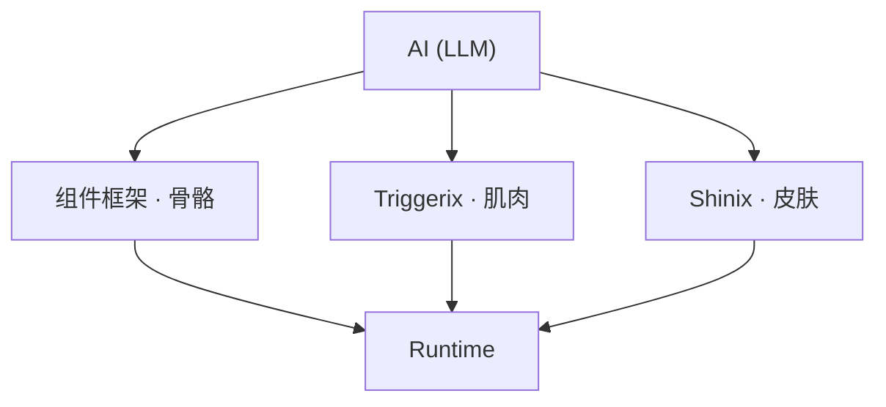
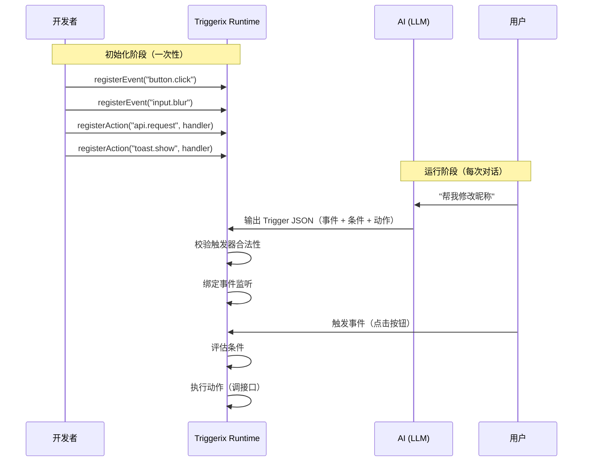

# Triggerix — AI 驱动的交互协议层

## 愿景

在 AI 对话流中，让 AI 自动生成可运行的完整 UI —— 不只是静态文本或代码片段，而是带有交互逻辑、样式效果、实际功能的组件实例。

Triggerix 是这套体系中的 **交互协议层**，负责声明式地描述"用户做了什么 → 满足什么条件 → 执行什么动作"。

---

## 生态定位

整套体系由三层协同组成：



| 层 | 职责 | 协议格式 |
|---|---|---|
| 组件框架 | 定义 UI 骨架：有哪些组件、怎么组合、数据从哪来 | JSON Schema |
| **Triggerix** | 定义交互行为：什么事件触发、什么条件满足、执行什么动作 | Trigger Schema (ECA) |
| Shinix | 定义视觉表现：颜色、间距、动画、响应式布局 | Style Schema |

三者完全独立，各自以 JSON Schema 作为协议格式，通过 Runtime 统一解析和执行。

---

## 工作流程

Triggerix 本身是 **业务无关** 的。它只提供 ECA 协议的定义、校验和执行引擎。具体的事件类型、条件逻辑、动作处理，全部由开发者（或 AI）通过注册机制注入。



**关键点**：Triggerix 不内置任何业务语义。`button.click`、`api.request` 这些都不是框架预设的 —— 它们由开发者根据自己的业务场景注册，Triggerix 只负责协调"当 X 发生 → 检查 Y → 执行 Z"的流程。

---

## 常见注册示例

以下是开发者通常会注册的事件和动作。这些只是示例，实际注册完全由业务决定。

<details>
<summary><strong>事件注册 (Event)</strong></summary>

```typescript
const runtime = createRuntime()

// UI 交互事件
runtime.registerEvent('button.click')
runtime.registerEvent('input.blur')
runtime.registerEvent('input.change')
runtime.registerEvent('form.submit')
runtime.registerEvent('list.itemClick')

// 生命周期事件
runtime.registerEvent('page.load')
runtime.registerEvent('page.unload')

// 其他
runtime.registerEvent('timer.tick')
runtime.registerEvent('file.selected')
```

</details>

<details>
<summary><strong>动作注册 (Action)</strong></summary>

```typescript
// 接口请求
runtime.registerAction('api.request', async (params) => {
  const res = await fetch(params.url, {
    method: params.method,
    body: JSON.stringify(params.body)
  })
  return res.json()
})

// 提示消息
runtime.registerAction('toast.show', (params) => {
  showToast(params.message, params.type)
})

// 页面跳转
runtime.registerAction('navigate.to', (params) => {
  router.push(params.path)
})

// 状态更新
runtime.registerAction('state.set', (params) => {
  store.set(params.key, params.value)
})

// 弹窗
runtime.registerAction('dialog.open', (params) => {
  openDialog({ title: params.title, content: params.content })
})

// 文件选择
runtime.registerAction('file.pick', (params) => {
  openFilePicker({ accept: params.accept, multiple: params.multiple })
})
```

</details>

<details>
<summary><strong>条件操作符（内置，无需注册）</strong></summary>

条件是协议层内置能力，开发者无需注册，直接在触发器中使用：

```typescript
import { defineCondition, defineConditionGroup } from '@triggerix/schema'

// 单个条件
const isEmpty = defineCondition({
  left: { $ref: 'input.value' },
  operator: 'eq',
  right: ''
})

// 条件组合
const canSubmit = defineConditionGroup({
  type: 'and',
  conditions: [
    { left: { $ref: 'input.value' }, operator: 'neq', right: '' },
    { left: { $ref: 'user.age' }, operator: 'gte', right: 18 }
  ]
})
```

支持的操作符：`eq` · `neq` · `gt` · `gte` · `lt` · `lte` · `exists`

支持的逻辑组合：`and` · `or` · `not`

</details>

<details>
<summary><strong>流程控制（内置，无需注册）</strong></summary>

流程控制也是协议层内置能力，用于编排复杂的动作序列：

```typescript
// 触发器中的 actions 可以使用流程节点
const trigger = defineTrigger({
  id: 'submit-profile',
  event: { type: 'button.click', source: 'save-btn' },
  actions: [
    sequence(
      { type: 'form.validate', params: { formId: 'profile' } },
      tryCatch({
        try: [
          { type: 'api.request', params: { method: 'POST', url: '/api/profile' } },
          { type: 'toast.show', params: { message: '保存成功' } }
        ],
        catch: [
          { type: 'toast.show', params: { message: '保存失败' } }
        ]
      })
    )
  ]
})
```

支持的节点：`sequence` · `parallel` · `if` · `tryCatch`

</details>

---

## Triggerix 的核心角色

### 它做什么

Triggerix 是 **Event → Condition → Action** 的行为协议：

- **Event**：描述触发时机（点击、输入、焦点、滚动、定时器...）
- **Condition**：描述前置条件（值是否为空、是否满足某个阈值...）
- **Action**：描述要执行的操作（调用接口、更新状态、导航跳转、显示提示...）

### 它不做什么

- 不负责 UI 结构（组件框架的事）
- 不负责视觉样式（Shinix 的事）
- 不直接操作 DOM 或渲染
- **不内置任何业务语义** — 事件和动作由开发者注册

### 为什么是 JSON Schema

1. **AI 友好**：LLM 天然擅长生成结构化 JSON，比生成可执行代码更可控、更安全
2. **语言无关**：同一份触发器可以在任意 Runtime（Web/Mobile/Desktop/Game）执行
3. **可校验**：生成的触发器可以立即通过 Schema 校验，确保合法性
4. **可组合**：触发器之间互不耦合，可以独立增删改
5. **可审计**：纯数据描述，便于记录、回放、调试

---

## 使用场景示例

### 场景 1：修改昵称

用户说："帮我修改昵称"

AI 输出的 Triggerix 部分（交互触发器）：

```json
[
  {
    "id": "validate-nickname",
    "event": { "type": "blur", "source": "nickname-input" },
    "conditions": {
      "type": "and",
      "conditions": [
        { "left": { "$ref": "nickname-input.value" }, "operator": "eq", "right": "" }
      ]
    },
    "actions": [
      { "type": "showToast", "params": { "message": "昵称不能为空" } }
    ]
  },
  {
    "id": "submit-nickname",
    "event": { "type": "click", "source": "submit-btn" },
    "conditions": {
      "type": "and",
      "conditions": [
        { "left": { "$ref": "nickname-input.value" }, "operator": "neq", "right": "" }
      ]
    },
    "actions": [
      {
        "type": "callAPI",
        "params": {
          "method": "POST",
          "url": "/api/user/nickname",
          "body": { "nickname": { "$ref": "nickname-input.value" } }
        }
      },
      { "type": "showToast", "params": { "message": "修改成功" } }
    ]
  }
]
```

### 场景 2：修改头像

用户说："我要换头像"

AI 生成的交互触发器：
- 点击头像区域 → 调用文件选择器（限制图片类型）
- 选择完成 → 预览图片 + 启用上传按钮
- 点击上传 → 调用接口上传文件

### 场景 3：点餐

用户说："我要点餐"

AI 生成的交互触发器：
- 点击餐品 → 导航到详情页
- 点击加入购物车 → 更新购物车状态 + 显示动画
- 购物车数量 > 0 → 显示结算按钮

---

## 设计原则

### 1. 协议只管结构

Triggerix 协议层只定义触发器的数据结构（event/conditions/actions 怎么写），不定义运行时行为（怎么跑、什么顺序、错了怎么办）。执行策略、错误处理、触发器优先级等运行时行为全部由 Runtime 实现者决定。

### 2. 业务无关

协议层不内置任何业务语义。事件类型、动作类型、`$ref` 引用路径能取到什么，全部由开发者注册和实现。Triggerix 只负责协调“当 X 发生 → 检查 Y → 执行 Z”的数据流转。

### 3. 声明式优先

触发器描述“做什么”而非“怎么做”。具体实现由 Runtime 决定。

### 4. AI 可生成性

所有触发器结构对 LLM 友好：
- 固定的顶层结构（event/conditions/actions）
- 有限且明确的操作符集合
- 值可以是字面量或引用路径
- 无需理解编程语言语法

### 5. 可组合、可增量

- 每条触发器独立，互不依赖
- AI 可以逐条追加，无需重写全部
- 用户修改一条触发器不影响其他

### 6. 安全沙箱

- 触发器只能描述预注册的动作类型
- Runtime 决定哪些动作可执行
- 不能执行任意代码

### 7. 渐进式复杂度

- 简单场景：一个 event + 一个 action，几行 JSON
- 复杂场景：条件组合 + 流程控制（sequence/parallel/if/tryCatch）+ 表达式计算
- 同一套协议覆盖从简到繁的全谱系

---

## 技术路线

### 阶段 1：协议稳定（当前）

- [x] Core 类型系统
- [x] Schema 构建器
- [x] JSON Schema 生成
- [x] Validator 校验
- [x] TypeScript 参考 Runtime
- [x] 表达式系统（V2）
- [x] 流程控制（V3）
- [x] Headless Editor 基础设施
- [x] Registry 注册表独立包

### 阶段 2：生态初步

- [x] triggerix-editor-preset-war3 适配新版协议
- [x] 演示站（github.io）— 直观展示 Triggerix 能力
- [x] 框架绑定层（triggerix-editor-vue）
- [ ] 协议规范文档（Spec）— 多语言实现的基础

### 阶段 3：AI 集成

- [ ] triggerix-ai — MCP 工具声明与能力约束
- [ ] AI Prompt 模板 — 教 LLM 如何正确输出 Triggerix 触发器
- [ ] 触发器模板库 — 常见交互模式的预制触发器
- [ ] Streaming 支持 — AI 流式输出中实时解析和渲染触发器
- [ ] 校验反馈回路 — 生成的触发器不合法时自动要求 AI 修正

### 阶段 4：完整生态

- [ ] 组件框架集成（AI 同时输出结构 + 交互 + 样式）
- [ ] Shinix 样式协议层联动
- [ ] 多语言 Runtime（Rust / Go / Kotlin）
- [ ] VS Code 插件 / Playground
- [ ] 触发器市场与社区模板

---

## 与竞品的差异

| 维度 | 传统低代码 | AI 代码生成 | Triggerix 体系 |
|---|---|---|---|
| 输出物 | 可视化拖拽配置 | 源代码 | JSON Schema 触发器 |
| AI 参与度 | 辅助建议 | 全量生成 | 精准结构化生成 |
| 可控性 | 高（但灵活性低） | 低（代码不可控） | 高（Schema 可校验可约束） |
| 安全性 | 依赖平台 | 风险高 | 沙箱执行，仅允许注册动作 |
| 增量修改 | 局部拖拽 | 通常需重写 | 触发器独立，逐条增删改 |
| 跨平台 | 依赖框架 | 依赖语言 | 语言无关，Runtime 适配 |

---

## 核心价值主张

> **让 AI 成为 UI 的实时建造者，而非代码的翻译器。**

传统路径：用户描述需求 → AI 生成代码 → 开发者审核 → 部署运行

Triggerix 路径：用户描述需求 → AI 直接生成触发器 → Runtime 即时执行 → 用户立即看到结果

差距在于：**从"AI 辅助开发"跃迁到"AI 直接驱动运行"**。
